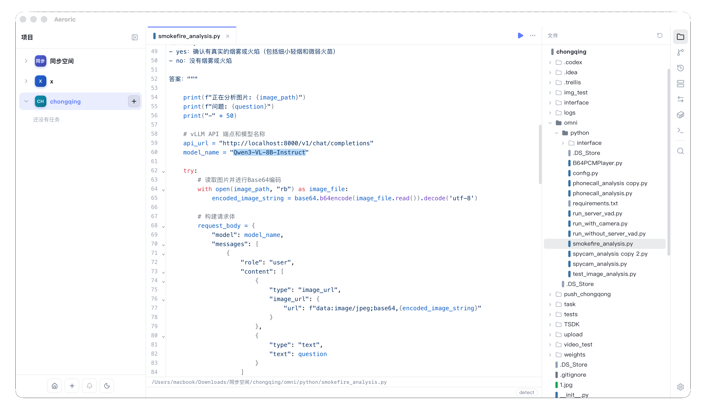
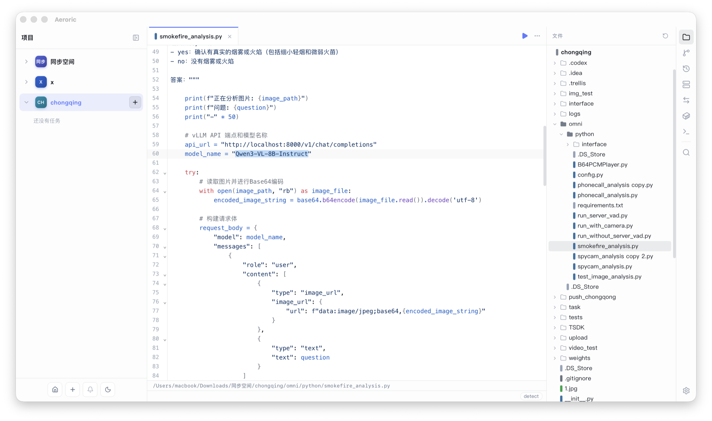
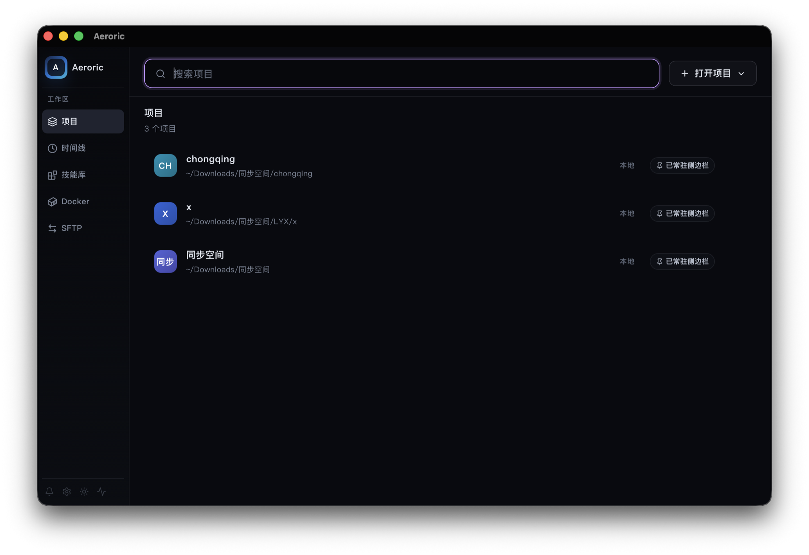

<p align="center">
  
</p>

<h1 align="center">NeZha：面向 AI 编程智能体的桌面工作台</h1>

<p align="center">
  在一个轻量桌面应用里同时管理 Claude Code、Codex、自定义智能体、多项目任务、实时终端、Git、SSH、Skill Hub 和用量分析。
</p>

<p align="center">
  
</p>

[English README](./README.md)

## 为什么是 NeZha

NeZha 面向 agent-first 的开发方式：多个 AI 编程任务可能同时在不同仓库、本机项目或远程机器上运行。你不需要在终端、编辑器、Git 客户端和会话日志之间来回切换，NeZha 把任务下发、终端输出、会话回放、代码查看、Git Review、提交和恢复都放到同一个工作台里。

NeZha 不替代 Claude Code 或 Codex，而是直接调用本机 CLI，并在外层补齐桌面任务管理能力：多项目导航、权限模式选择、PTY 终端、会话自动发现、本地任务持久化、文件浏览、Git 差异查看和用量统计。

## 安装

使用前请先安装 Claude Code 和/或 Codex。macOS 首次打开未签名应用时，如果系统提示应用已损坏或无法打开，执行：

```bash
xattr -rd com.apple.quarantine /Applications/NeZha.app
```

## 当前功能

- **多项目工作区**：在本地项目和 SSH 远程项目之间切换，后台任务继续运行。
- **智能体任务生命周期**：创建 todo 任务，启动 Claude Code、Codex 或自定义智能体，恢复会话、取消任务，并跟踪 pending、running、input_required、done、failed、cancelled 等状态。
- **实时终端执行**：基于 xterm.js 的 PTY 终端展示真实输出，支持交互输入、智能复制、换行快捷键、字体设置和输入法安全输入。
- **会话自动发现与回放**：自动关联 Claude Code / Codex 的 JSONL 会话文件，在 UI 中查看历史消息并恢复任务。
- **原生 Git 工作流**：查看未暂存/已暂存变更、阅读 diff、生成 commit message、提交、推送、拉取和浏览历史。
- **代码与文件工具**：浏览项目文件树、预览图片、编辑源码和 Markdown，并在提示词中使用文件提及。
- **SSH 与 SFTP**：打开远程项目、运行远程 Shell、浏览远程文件，并管理本地连接配置。
- **Skill Hub**：登记本地技能库，把 skills 作为项目编辑，并让 Superpowers / Trellis 风格的技能库可被智能体使用。
- **用量分析**：读取会话指标，展示 token 消耗和工具调用，方便跟踪长任务成本。
- **应用设置**：配置智能体路径、自定义智能体、界面语言、主题、字体、终端字号和任务展示偏好。

## 截图

<p align="center">
  
</p>

<p align="center">
  
</p>

## 开发

```bash
pnpm dev            # 启动 Vite 开发服务器，端口 1420
pnpm build          # 类型检查并构建前端
pnpm lint           # 运行 ESLint
pnpm test           # 运行 Vitest
pnpm tauri dev      # 启动桌面应用
pnpm tauri build    # 构建生产桌面包
```

前端使用 React 19 + TypeScript + Vite，桌面壳使用 Tauri 2 + Rust。后端命令位于 `src-tauri/src/`，核心应用状态由 `src/App.tsx` 管理，并通过 Tauri 存储命令持久化。

## 致谢

NeZha 基于 [Tauri](https://github.com/tauri-apps/tauri)、[React](https://github.com/facebook/react)、[xterm.js](https://github.com/xtermjs/xterm.js)、[CodeMirror](https://codemirror.net/) 和 [Shiki](https://shiki.style/) 等优秀开源项目构建。
