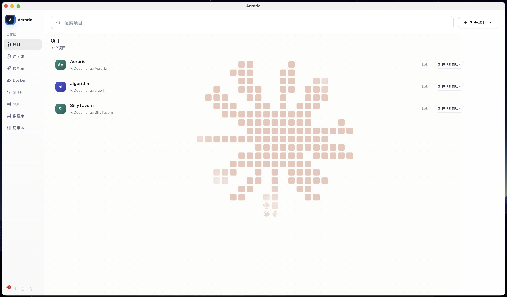
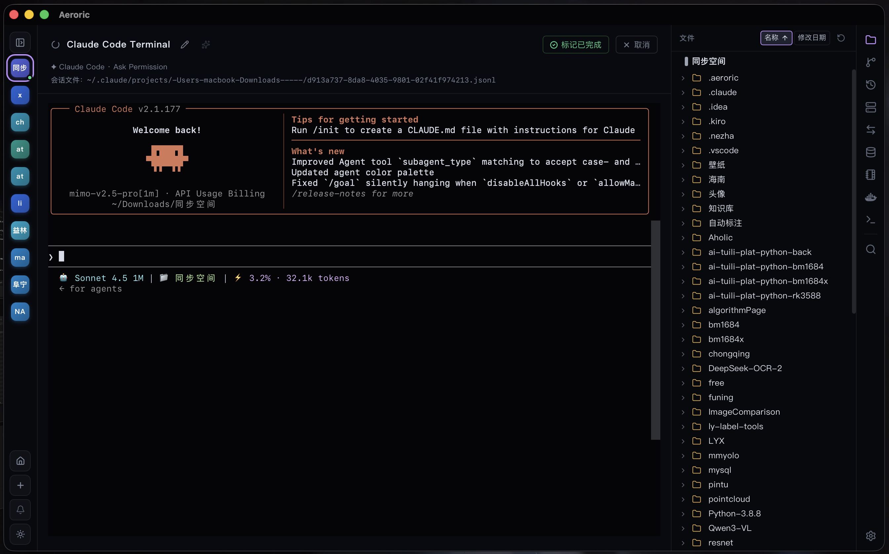
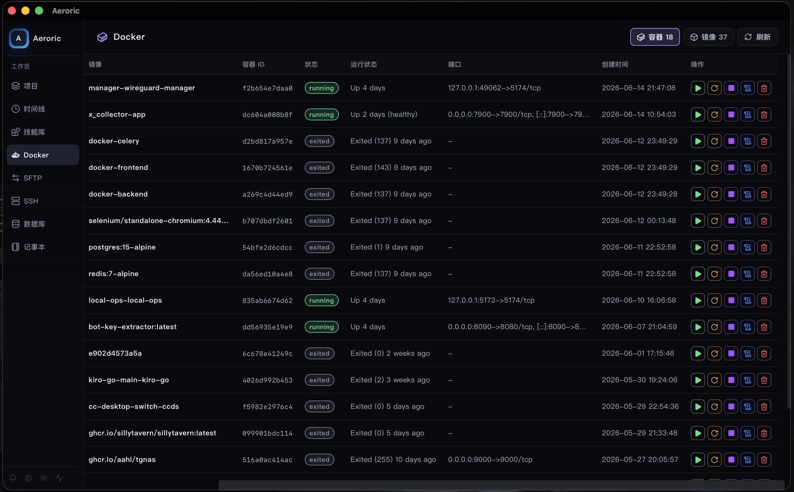
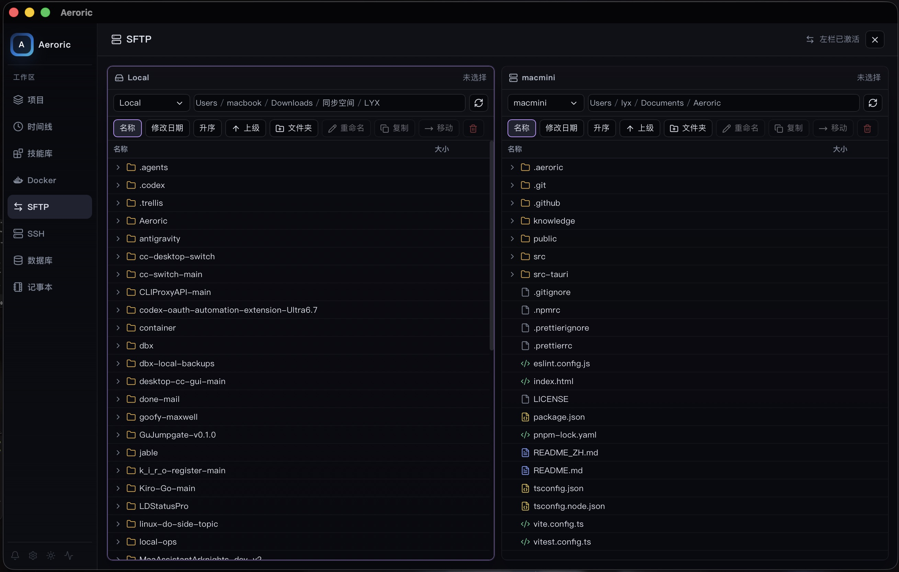
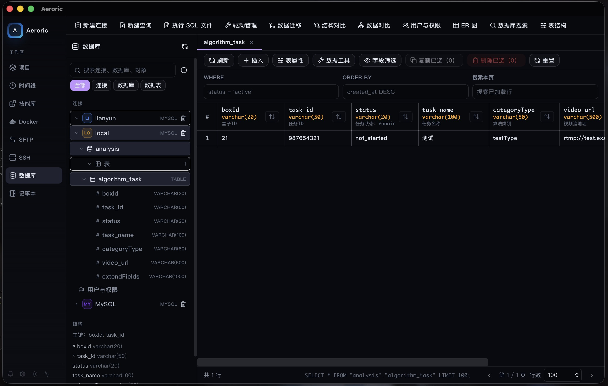

<p align="center">
  
</p>

<h1 align="center">Aeroric：面向 AI 编程智能体的桌面工作台</h1>

<p align="center">
  在一个轻量桌面应用里同时管理 Claude Code、Codex、自定义智能体、多项目任务、实时终端、Git、SSH、SFTP、Docker、Skill Hub、Markdown 编辑和版本发布流程。
</p>

<p align="center">
  <a href="./README.md">English README</a>
</p>

<p align="center">
  
</p>

## 为什么是 Aeroric

Aeroric 面向 agent-first 的开发方式：多个 AI 编程任务可能同时在本地仓库、远程机器和运维环境中运行。你不需要在终端、编辑器、Git 客户端、Docker 工具、发布页面和会话日志之间来回切换，Aeroric 把任务下发、终端输出、文件查看、Markdown 编辑、脚本运行、代码 Review 和版本发布都放到同一个桌面工作台里。

Aeroric 不替代 Claude Code 或 Codex，而是直接调用本机 CLI，并在外层补齐桌面任务管理能力：多项目导航、权限模式选择、PTY 终端、会话自动发现、文件浏览、SFTP/SSH 操作、Git 差异查看、Docker 状态查看和本地任务持久化。

## 可以做什么

- **统一首页工作台**：集中查看项目、时间线、技能库、Docker、SFTP、SSH、数据库、记事本、设置和运行状态。
- **管理项目工作区**：打开本地或远程项目，让智能体任务在后台继续运行，并快速回到对应上下文。
- **运行 Claude Code、Codex 和自定义智能体**：创建任务、选择权限模式、查看 PTY 实时输出、交互输入、恢复会话和取消任务。
- **浏览、修改并运行项目文件**：在同一流程里完成仓库文件浏览、源码修改、脚本执行和调试迭代。
- **阅读和编辑 Markdown**：在渲染阅读模式与源码编辑模式之间切换，适合维护 README、计划、规格文档和笔记。
- **操作开发基础设施**：查看 Docker 容器和镜像，使用 SFTP/SSH 工具，并检查本地开发和部署运行状态。
- **集中管理技能与数据工具**：在同一侧边栏里查看本地 Skill Hub 内容和数据库相关项目资源。
- **Review 并发布代码**：查看 diff、暂存文件、生成 commit message、提交、推送，并在桌面流程里管理发布页面。
- **跟踪用量与会话**：自动发现 Claude Code / Codex 的 JSONL 会话，并查看 token 消耗和工具调用指标。

## 产品功能截图

### 首页

首页把项目、时间线、技能库、Docker、SFTP、SSH、数据库、记事本、设置和状态入口集中到一个工作台里。

<p align="center">
  
</p>

### 项目首页

项目页把任务列表、智能体控制、文件工具、Git 上下文和工作区操作放在一起，让每个仓库都能独立管理并保留状态。

<p align="center">
  
</p>

<p align="center">
  
</p>

### Claude 终端

Claude Code 和其他智能体运行在 PTY 终端中，支持实时输出、交互输入、会话控制、复制、字体设置、文件上下文和输入法安全输入。

<p align="center">
  
</p>

<p align="center">
  
</p>

### 浏览、修改、运行脚本

Aeroric 把文件浏览、源码编辑和命令执行放在同一工作流里，适合智能体辅助调试、脚本迭代和仓库维护。

<p align="center">
  
</p>

### 阅读模式查看 Markdown 文件

内置 Markdown 渲染预览，便于在提交前检查 README、计划文档、规格说明和自动生成报告。

<p align="center">
  
</p>

### 编辑模式查看 Markdown 文件

Markdown 文件也可以直接进入源码编辑模式，文档维护不需要离开当前项目工作台。

<p align="center">
  
</p>

### Docker

Docker 页面展示容器和镜像列表、状态、运行时长、端口映射和刷新控制，便于检查本地开发与部署环境，并支持亮色与暗色主题。

<p align="center">
  
</p>

<p align="center">
  
</p>

### SFTP

SFTP 工具把远程文件传输和远程项目查看放在本地项目工作流旁边，适合部署、排障和服务器侧文件维护，并跟随当前主题。

<p align="center">
  
</p>

<p align="center">
  
</p>

### SSH

SSH 连接可以在 Aeroric 中集中管理，远程 Shell、项目操作和智能体辅助终端任务都能留在同一个桌面环境里，并同时支持亮色与暗色工作区。

<p align="center">
  
</p>

<p align="center">
  
</p>

### 技能库

技能库用于查看和编辑本地 skills，让智能体复用团队工作流、代码规范和专用处理流程。

<p align="center">
  
</p>

### 数据库

数据库相关工具集中在侧边栏中，方便在不离开工作台的情况下查看应用状态和配套资源，并跟随当前工作区主题。

<p align="center">
  
</p>

<p align="center">
  
</p>

### 版本发布页面

版本发布页面用于汇总版本上下文、检查发布状态，并把发布动作和对应代码变更放在同一个桌面流程里。

<p align="center">
  
</p>

### 递归动画

Aeroric 支持递归式、多步骤的智能体任务流：任务可以启动、输出、派生后续操作，并在演进过程中持续可见。

<p align="center">
  
</p>

## 安装

使用前请先安装 Claude Code 和/或 Codex。macOS 首次打开未签名应用时，如果系统提示应用已损坏或无法打开，执行：

```bash
xattr -rd com.apple.quarantine /Applications/Aeroric.app
```

## 开发

```bash
pnpm dev            # 启动 Vite 开发服务器，端口 1420
pnpm build          # 类型检查并构建前端
pnpm lint           # 运行 ESLint
pnpm test           # 运行 Vitest
pnpm tauri dev      # 启动桌面应用
pnpm tauri build    # 构建生产桌面包
```

前端使用 React 19 + TypeScript + Vite，桌面壳使用 Tauri 2 + Rust。后端命令位于 `src-tauri/src/`，核心应用状态由 `src/App.tsx` 管理，并通过 Tauri 存储命令持久化。

## 致谢

Aeroric 基于 [Tauri](https://github.com/tauri-apps/tauri)、[React](https://github.com/facebook/react)、[xterm.js](https://github.com/xtermjs/xterm.js)、[CodeMirror](https://codemirror.net/) 和 [Shiki](https://shiki.style/) 等优秀开源项目构建。
