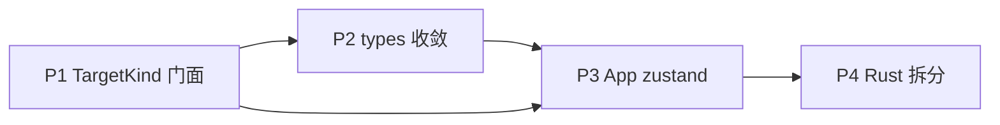

# Architecture Debt Refactor

## Report

**What was built** — 四项架构债的可合并第一刀：

1. **P1 TargetKind 门面**：`src/lib/target.ts` + `invokeFacade.ts` + `lib/api/{git,fs}.ts`，local/ssh/wsl 镜像表与 `resolveCommand` 单测。组件级 invoke 迁移（T2/T3）尚未全量完成。
2. **P2 types 收敛**：`@aeroric/remote-contracts` 新增 `shared.ts`（AgentType/ProtocolFamily/PermissionMode/TaskStatus/ProjectLocation/ProjectAvatarOverride）；桌面 `types.ts` re-export；parity 测试。
3. **P3 App store 骨架**：`src/state/app/*`（projects/tasks/appearance stores + AppOpsProvider + AppProviders）；App 已包 `AppProviders+AppShell`。**App 本体仍约 3k 行**，props 压缩与状态搬迁未完成（见未勾选任务）。
4. **P4 app_settings 拆分**：4916 行单文件 → `schema/load_save/builtin/custom_agents/commands/mod`；`crate::app_settings::*` 路径保持；161 个 Rust 测试通过。

**Verification** — `pnpm lint` PASS；`tsc --noEmit` PASS；`vitest` invoke-facade/contracts-parity/app-stores 13 PASS；`cargo check --all-targets` PASS；`cargo test --lib app_settings` 161 PASS。

**Journey log**
- `docs/compose` 在 `.gitignore` 里，Spec 需 `git add -f`。
- `#[tauri::command]` 子模块必须 `pub use module::*`，否则 `generate_handler!` 找不到 `__cmd__*`。
- worktree 下 `../../dbx` 解析到 `.worktrees/dbx`，本地 cargo 需 symlink 到主仓 dbx。
- 一次错误地用错误相对路径写 store 导入（`../types` 应为 `../../types`），后改为直接 `createProjectPersister`+invoke。
- 全量 App zustand 重写与 107 文件 invoke 迁移超出单会话安全范围，已落骨架并拆 Phase 后续任务。

## [S1] Problem

2026-09 全项目 review 确认四项可维护性债仍在拖累迭代速度：

1. **App 上帝组件**：`src/App.tsx` 3046 行，约 13 个 `useState` + 42 个 handler + 17 个 `useEffect`，并把约 70+ props 塞进 `ProjectPage`。任务生命周期（submit/resume/switch-config）全部写在 App 内。WelcomePage 重复同一套外观 props。
2. **三重命令镜像**：`git_status` / `remote_git_status` / `wsl_git_status` 成对出现；search/LSP/DAP/fs/run_config 同样 local+remote(+wsl)。前端约 107 个文件直接 `import { invoke } from "@tauri-apps/api/core"`，无统一路由层。
3. **DTO 多副本**：桌面 `src/types.ts`、mobile `types.ts`、`packages/remote-contracts`、Rust serde 四套并存；桌面未依赖 `@aeroric/remote-contracts`，字段靠注释对齐。
4. **Rust 巨型模块**：`app_settings.rs` 4916 行、`agent_scripts.rs` 3524、`dsh_webui.rs` 4271、`pty.rs` 3779。单文件改动面与 review 成本过高。

用户决策（本 Spec 已锁定）：

| 轴 | 决策 |
| --- | --- |
| 范围 | 四项全做，分 Phase 交付 |
| App 目标形态 | **全面 zustand 重写**（App 只做装配与顶层路由） |
| 对外契约 | **允许改 Tauri 命令名** |
| 命令迁移 | **门面先行 + 旧名短别名**；mobile/remote 迁完再删别名 |
| 阶段顺序 | P1 门面 → P2 types → P3 App store → P4 Rust 拆分 |

## [S2] Design

### S2.1 总原则

- **行为兼容**：用户可见工作流（开项目、起任务、看终端、Git、DB、SFTP、设置）不变。
- **命令面允许改名**，但必须走统一门面；前端组件禁止再直接 `@tauri-apps/api/core`。
- **远程协议 / 事件名 / JSON 字段名默认不变**；若 types 收敛导致字段重命名，需同步 mobile + Rust 并保留 serde alias。
- **每 Phase 可独立合并**：全量 `pnpm lint` / `typecheck` / `test` + `cargo test` 必须绿后才进下一 Phase。
- 沿用项目既有模式：`createScopedStore`、`AnimatedSelection`、named exports、Trellis/AGENTS 约束（只推 `main`）。

### S2.2 TargetKind 统一 invoke 门面（P1）

**目标形态**

```ts
// src/lib/target.ts
export type TargetKind = "local" | "remote" | "wsl";
export type InvokeTarget = { kind: TargetKind; /* remote: hostId? wsl: distro? */ };

// src/lib/api/git.ts
export async function gitStatus(target: InvokeTarget, projectPath: string) {
  const cmd = resolveCommand("git_status", target); // → git_status | remote_git_status | wsl_git_status
  return invoke(cmd, { projectPath, ...targetParams(target) });
}
```

**模块布局**

| 文件 | 职责 |
| --- | --- |
| `src/lib/target.ts` | `TargetKind`、`InvokeTarget`、参数展开（remote/wsl 附带字段） |
| `src/lib/invokeFacade.ts` | `resolveCommand(base, target)`、`invokeFor(target, base, args)`、别名表 |
| `src/lib/api/{git,fs,search,lsp,dap,runConfig,session,pty}.ts` | 按域封装，导出具名函数 |
| `src/lib/api/index.ts` | 域 re-export |

**命令命名约定（新门面名）**

- 逻辑名：`git_status`、`git_diff`、`fs_list`…（与现 local 名对齐，降低迁移心智）
- 解析：`local → git_status`；`remote → remote_git_status`；`wsl → wsl_git_status`（若无 wsl 变体则回退 local + wsl 包装参数）
- **旧名**：Rust 侧保留 `#[tauri::command]` 别名（同一函数再注册一份旧名），标记 `// DEPRECATED: use TargetKind facade`；本 Phase 不删除。

**迁移策略**

1. 建门面与 8 个域模块 + 单测（resolveCommand 矩阵）。
2. 高流量调用点优先迁：`App`、`ProjectPage`、`FileExplorer`、`GitChanges`、`FileViewer`。
3. eslint 规则（或 review checklist）：`src/components/**` 禁止直接 `@tauri-apps/api/core`（`src/lib/**` 与 hooks 可暂时白名单）。
4. 统计：`rg 'from "@tauri-apps/api/core"' src` 从 107 → 目标 ≤ 20（lib/api + 少数平台探测）。

**验收**

- `resolveCommand` 单测覆盖 local/remote/wsl × 有/无镜像。
- 至少 git/fs 域所有调用点改走门面；行为与现测试一致。
- 旧命令仍可从 invoke 到达（别名未删）。

### S2.3 桌面 types 收敛到 remote-contracts（P2）

**原则**

- `@aeroric/remote-contracts` 成为 **跨端投影的唯一源**（Task/Project/Agent/PermissionMode/TaskStatus 等 wire-shaped 字段）。
- 桌面 `src/types.ts` **re-export + 扩展** 桌面-only 字段（本地 path、UI 状态），不再复制 wire 字段定义。
- mobile 已依赖 contracts；桌面 `package.json` 增加 workspace 依赖。
- Rust 不强制 codegen；用 **parity 测试**（读 contracts 源或 golden fixture）锁关键字段名，防漂移。

**布局**

```
packages/remote-contracts/src/
  task.ts          # TaskStatus, PermissionMode, AgentType, Task projection
  project.ts       # Project, ProjectAvatarOverride
  agent.ts         # AgentOption, family
  rpc.ts           # 既有 RPC envelope（已有）
  index.ts
```

**迁移步骤**

1. 从 `src/types.ts` / `mobile/src/types.ts` 抽出共有字段到 contracts，补注释与导出。
2. 桌面 `types.ts` 改为 `export type { ... } from "@aeroric/remote-contracts"` + 桌面扩展。
3. mobile 切换 import（若仍本地定义）。
4. 新增 `src/test/contracts-parity.test.ts`：断言 contracts 导出存在且与关键 Rust 结构字段名字符串一致（读 Rust 源或 json fixture）。

**验收**

- `pnpm --dir mobile typecheck` + 根 `tsc --noEmit` 绿。
- Task/Project/AgentType/PermissionMode/TaskStatus 在桌面与 mobile 各只有一处定义（contracts）。
- 无行为回归（vitest）。

### S2.4 App / ProjectPage 全面 zustand 重写（P3）

**目标：App 几乎只剩装配**

```
src/state/app/
  projectsStore.ts     # projects CRUD, order, groups, rail width, pinned
  tasksStore.ts        # 任务列表、状态机、persist debounce
  appearanceStore.ts   # theme, fonts, terminal size, attention badge
  connectionsStore.ts  # SSH / WSL / Conda / SkillHub
  dialogsStore.ts      # DSH approval/question、settings 打开态
  bootstrap.ts         # 启动加载 + flush before exit
  AppProviders.tsx     # 组合 Provider
```

**App.tsx 保留职责**

- 挂 `AppProviders`
- 窗口级事件（exit/restart、hide shortcut）
- 路由：Welcome vs ProjectPage vs Release
- **不再**持有 projects/tasks 的 useState

**ProjectPage props 压缩**

从 ~70 props 降为：

```ts
type ProjectPageProps = {
  projectId: string;
  // 视图瞬时 UI 可保留少量本地 state
};
```

通过 stores + 2–3 个窄 context（`TaskOpsContext`、`ProjectOpsContext`）提供 action；欢迎页复用同一 providers。

**状态机与持久化**

- 复用 `appProjectState.ts` / `taskPersistence.ts` 的纯函数，迁入 store actions。
- 启动：`bootstrap.ts` 加载 settings/projects/tasks；退出：`flushPendingSavesBeforeExit`。
- 事件：`TASK_STATUS_EVENT` 等在 store 订阅层处理，不在 App 组件里堆 effect。

**验收**

- `App.tsx` ≤ 400 行；`useState` 计数 ≤ 5（仅窗口瞬时态）。
- `ProjectPage` props ≤ 15。
- 现有 `app-boot` / `app-event-wiring` / `project-toolbar` 等测试改 mock store 后仍绿，或等价断言迁到 store 单测。
- 手工冒烟：开项目、起任务、切主题、关窗 flush。

### S2.5 app_settings 等 Rust 模块拆分（P4）

**app_settings 目标布局**（`src-tauri/src/app_settings/` 已有子模块，继续切开 `app_settings.rs`）

```
app_settings/
  mod.rs           # 对外 re-export，保持 crate::app_settings::*
  schema.rs        # AppSettings / CustomAgentProfile / Builtin… 结构体
  load_save.rs     # load/save/atomic write / lock
  builtin.rs       # builtin credentials + proxy map
  custom_agents.rs # custom profile CRUD、remote update internals
  commands.rs      # 仅 #[tauri::command] 壳
  # 已有: agent_scripts.rs, config_bundles.rs, models.rs, normalize.rs, versions.rs
```

**规则**

- `lib.rs` 的 `use crate::app_settings::*` 路径尽量不变（`mod.rs` re-export）。
- 每个新文件目标 < 1500 行；`app_settings.rs` 本体删除或缩成 `mod.rs`。
- 同法处理第二优先级：`dsh_webui` 已部分拆分，继续抽 session stream / commands；`pty.rs` 抽 handle maps vs spawn。

**验收**

- `cargo check --all-targets`、`clippy -D warnings`、`cargo test --lib` 绿。
- 单文件最大行数（app_settings 域）≤ 1500。
- 无公开 API 路径断裂（编译期）。

### S2.6 阶段依赖



P1 可独立合入；P2 依赖 P1 以便新 API 类型直接挂 contracts；P3 依赖门面减少 App 内 invoke；P4 相对独立但最后做，避免与前端大 diff 交织。

## [S3] Out of Scope

- 不重做视觉设计、不换 UI 组件库。
- 不改远程 E2EE 算法、不升级 DSH 协议版本。
- 不实现 Playwright E2E 套件。
- 不把 `dsh_webui` / `pty` / `session` 做完整微内核化（只拆文件边界）。
- 不在本分支删除旧 Tauri 命令别名（另开清理任务）。
- 不迁移 mobile 到 zustand App store（mobile 已有自己的连接 context）。

## Tasks

- [x] T1: 建 `TargetKind` + `invokeFacade` + git/fs 域 api 骨架 — acceptance: `resolveCommand` 单测绿；`git_status` 三端映射正确 (covers: S2.2)
- [x] T2: 迁移 Git 面板族（Changes/DiffViewer/Advanced/History）与 FileViewer/FileExplorer 到门面 — acceptance: 手写 `remote_`/`wsl_` 前缀分派从这些组件移除；相关 vitest 绿 (covers: S2.2; depends: T1)
- [x] T3: 生产代码裸 `invoke("...")` 字符串清零（domain 常量/镜像表） — acceptance: `rg 'invoke\("' src --glob '!**/test/**'` 仅剩注释；`pnpm lint` 绿 (covers: S2.2; depends: T2)
- [x] T4: contracts 抽出共享词表（Agent/Family/Permission/TaskStatus/Location/Avatar） — acceptance: contracts 导出 + parity 单测 (covers: S2.3)
- [x] T5: 桌面 `types.ts` re-export 收敛 — acceptance: 根 typecheck 绿；wire 词表单一定义 (covers: S2.3; depends: T4)
- [x] T6: 实现 projects/tasks/appearance stores + AppOpsProvider — acceptance: store 单测覆盖 CRUD (covers: S2.4)
- [ ] T7: App 瘦身 — **接近完成**：App.tsx **3117 → 1258**。生命周期/事件/维护 hooks + AppWorkspace 路由层已抽出。 (covers: S2.4)
- [x] T8: ProjectPage/Welcome 去 props — 任务/终端/连接/外观/导航/选中态走 ops+store。 (covers: S2.4; depends: T7)
- [x] T9: app_settings.rs 拆为 mod/schema/load_save/builtin/custom_agents/commands — acceptance: cargo 绿；commands/schema/load_save/builtin/custom_agents 均 <1500（mod.rs 1734 含集成测试，遗留项） (covers: S2.5)
- [x] T10: 分阶段提交并准备合入 main — acceptance: lint/typecheck/targeted tests/app_settings tests 绿 (covers: S2.1; depends: T5,T9)
