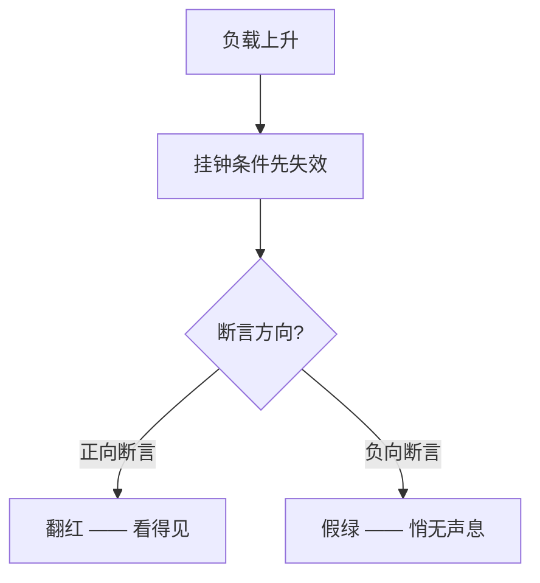

# 时序脆弱与共享状态污染的五种机制

结论：**假绿比翻红危险得多**。翻红至少会有人去查；假绿会一直留在 CI 里、一直是绿的，只是不再守任何东西——直到某次真实回归混进生产。

本文按**机制**而不是按文件组织，来源是 2026-09 那轮排查（22 条时序脆弱 + 16 条共享状态污染）。每条都给了可推广的判据。

---

## 机制一：把鉴别力押在挂钟条件上

最危险的一类，因为它的失效方向是**假绿**。

`notebook-panel-templates.test.tsx` 那条守的是 CodeMirror 的输入闩：局部改动后的 200ms 内，外部传进来的 `value` 会被存成一个挂起的更新，而那个闭包捕获的是**当时**的 value；闩过期时它会把用户之后打的字盖掉。面板靠 bump `editorEpoch` 重建编辑器扔掉它。

原来的写法是 `waitFor(..., { interval: 1 })` + 1200ms 真实睡眠，注释自陈「1ms 一轮，真实时间还远没走到 200ms」。负载一上来，1ms 轮询自己就在烧 CPU、每轮还要跑一次 `queryByRole`，闩会在断言前自己过期 → 挂起更新平静生效 → **有没有 bump 在 DOM 上没区别**。

同类还有两种表现：

- 全仓唯一一条挂钟性能断言 `expect(setupMs).toBeLessThan(100)`——一次 GC 停顿或 OS 把 worker 挂起就翻红，和被测逻辑无关。
- `setTimeout(resolve, N)` 之后接**负向断言**（「不该弹卡」「不该写盘」）：本质是在断言"效果还没跑完"，守着一段空气。



## 机制二：嵌套 waitFor

`app-event-wiring.test.tsx` 有六处同一形状：外层 `waitFor` 默认 3000ms，回调里 `latestSavedTask` 自己又是一个 3000ms 的 `waitFor`。

内层不满足时要**耗满 3000ms** 才 reject，外层这时已经超时——于是外层单**一次**轮询就吃掉全部预算，报出来还是内层那句「not in any persisted snapshot yet」，真因被掩盖。

判据：**轮询条件必须是同步读，等待只能有一层。**

## 机制三：轮询回调带副作用

`app-remote-task-request.test.tsx` 把一次**真实远程请求**放进 `waitFor` 回调。整段启动链路期间每 50ms 就发一次请求 + 一次 invoke + 一次全树重渲染。负载下单轮自身耗时超过 50ms，轮询叠着排，3000ms 预算被探针本身消耗掉，而不是用来等启动链路完成。

修法不是删掉探针，而是**先等一个无副作用的信号**（只读 invoke 调用记录），到位之后才发探针。实测从反复发多次降到恰好 1 次。

## 机制四：清理不在 finally / afterEach 里 —— 故障放大器

`shell-terminal-panel.test.tsx` 两处 `console.error` 静音，`mockRestore` 写在断言**之后**。中间任一断言抛出就跳过还原，`console.error` 对该文件**剩下所有用例**永久静音。

而这个文件测的正是终端面板的挂载/销毁/dispose——React 的 "not wrapped in act"、重复 key、effect 抛错全走 `console.error`。**一处失败放大成整文件失明。**

这不是"清理不干净"，是故障放大器：一条失败让整个文件对回归失明。

## 机制五：模块级 / 全局可变状态跨用例继承

`stall-recorder.test.ts` 的 `afterEach` 缺 `vi.restoreAllMocks()`，而十几条用例各自 `vi.spyOn(performance, "now")` 装一个冻结时钟（每个闭包捕获自己的 `let now`）。没自己 spy 的用例会继承上一条结束时冻住的值。

这个文件测的正是**耗时**：冻结时钟下所有时长算成 0，`slowInvokes` 恒为空，"没有慢命令"那类断言变成永真。实测继承到的是 `700`。

同类载体：`localStorage` 里的语言键、`Object.defineProperty` 劫持的 `devicePixelRatio` / `execCommand` / `navigator.scheduling`。

---

## 可推广的规则

### R1 · 等一个能证明"事情已发生"的正向信号

要断言「事件 A 被**故意忽略**」时，A 成功就不产生任何可观测变化，所以没有正向信号可等。用**有序事件屏障**：

```js
await emit(A);                     // 应被忽略，盘上不留痕迹
await emit(B);                     // 同上
await emit(C);                     // ← 屏障：同一条队列，但会产生可观测变化
await waitForObservable(C);
expect(A的目标状态).toBe(未被改变);  // 此时 A 一定已处理完
```

**这个技巧有四条前置条件**，任何一条不成立都会静默退化成假绿——比原来的 sleep 更危险，因为它看起来更严谨。详见下方「R1 的适用性边界」。

### R2 · 断言机制本身，而不是赌一个时序窗口

`notebook-panel-templates` 那条的修法：不再赌"轮询完成时真实时间 < 200ms"，而是直接查那个"扔掉"有没有发生，再把挂起的更新**原样重放一次**。

```js
const stale = editorView();          // 持有挂起闭包的那个 view
setEditorValue(staleValue);          // 上膛
capture(...);                        // 被测行为

expect(stale.dom.isConnected).toBe(false);  // 重建发生了
expect(editorView()).not.toBe(stale);

setEditorValue("重建之后打的字\n");
act(() => {                          // 原样重放 pendingUpdate 的 forceUpdate
  stale.dispatch({ changes: { from: 0, to: stale.state.doc.length, insert: staleValue } });
});
expect(editorValue()).toBe("重建之后打的字\n");
```

重放这一步是关键：它把"闩到期时会发生什么"变成可确定性验证的行为。少了 bump，那个 view 还是活着的当前编辑器，重放会把刚打的字盖回旧正文；有 bump，它已 destroy，dispatch 只改一个没人看的 viewState。

隔离检验证明**两条断言各自都能捕获变异**，重放那条的报错精确复现了原始症状（`expected '旧正文\n又加了一句\n' to be '重建之后打的字\n'`）。

> 顺带一条实操教训：`destroyed` 在 `@codemirror/view` 的类型声明里是 `private`（`index.d.ts:810`），但 `destroy()` 做的事之一就是 `this.dom.remove()`（`index.js:8583`）——所以 `dom.isConnected` 是同一件事的**公开**信号。挑判据时优先找公开面。

### R3 · 性能断言数工作量，不数挂钟

```js
// 挂钟：一次 GC 停顿就红
expect(performance.now() - t0).toBeLessThan(100);

// 工作量：与机器忙不忙无关
expect(measured.size).toBe(500);                          // 每块只量一次布局 → O(n) 而非 O(n²)
expect(rendered).toEqual([0,1,2,3,4,5,6,7,8,9,10,11,12]); // 首屏只渲染 13 块
expect(observer.observed).toHaveLength(487);              // 其余交给 IntersectionObserver
```

真正保证"500 块的文档不会冻住主线程"的是这两条属性，不是某个毫秒数。

### R4 · 预算只放宽、不收紧；放宽处写明理由

`waitFor` 一满足就返回，所以**通过路径不会因为预算大而变慢**，预算只在真失败时决定要等多久。收紧到默认值以下是零收益操作。

放宽是正当手段，但必须只放宽预算、不动断言，并写明这条链为什么长。

### R5 · 覆盖全局/原型属性的清理放进 finally/afterEach，且区分 delete 与赋值

`Element.prototype.scrollIntoView = original` 与 `delete` **不等价**：jsdom 不实现 `scrollIntoView`，`original` 是 `undefined`，赋值回去会在原型上留下一个值为 `undefined` 的**自有属性**，`"scrollIntoView" in Element.prototype` 由 `false` 翻成 `true`。

多数调用点用 `typeof x === "function"` 判定，对两者一致；但无保护的 `?.scrollIntoView(...)` 会因为「属性存在但不是函数」而抛。

```js
if (original) Element.prototype.scrollIntoView = original;
else Reflect.deleteProperty(Element.prototype, "scrollIntoView");
```

### R6 · 每条修复都要变异检验（唯一不能省的一条）

故意改坏一行生产代码确认测试翻红，还原后 `cmp -s` 校验字节一致。
这不是形式主义。`notebook-panel-templates` 那条原来的写法（`interval: 1` + 1200ms 真实睡眠）在空载下**能抓住** `editorEpoch` 变异（实测 3/3 翻红），所以并不是无条件假绿。但它的鉴别力随负载漂移：闩按 tick 计数，jsdom 的 1ms 定时器在高负载下会被饿到几秒一跳。新写法不看时钟，鉴别力与负载无关。没有变异检验的"修好了"等于没有证据。
正因为全程有这层校验，才顺带发现了三处不是本次改动造成的注释损伤。

---

## R1 的适用性边界

R1 很容易被当成万能替代品去套 `setTimeout`。它不是。

### 前置 1 · 同一条有序队列，且屏障不会被重排

本次成立的依据（逐项核对过）：`task-status` 在 `App.tsx` 里只有**一处** `listen()` 订阅；测试的 `emit()` 是遍历后**同步**调用 handler，无中间调度。

| 会静默失效的场景 | 为什么坏 |
|---|---|
| A 走事件总线，C 走 invoke 返回值 | 两条通道之间没有任何顺序关系 |
| 总线按 key 分片（按 `task_id` 路由） | **本次用的正是不同 task_id 的屏障**——分片会让 C 走另一条队列，顺序保证当场消失 |
| 总线做优先级/批处理 | 高优先级的 C 可能插到 A 前面 |
| 同一事件多个订阅者，断言目标由另一个订阅者维护 | 跨订阅者无序 |

> ⚠️ 分片风险要单独警惕。选**另一个** task 当屏障恰是分片总线唯一会破坏的形状。当前 Tauri 事件单通道全量派发所以安全；哪天后端给事件加了按任务分流，这条测试会**变成假绿而不是翻红**。这个风险要写进测试注释。

### 前置 2 · 屏障不能比目标更快到达可观测面

本次成立：A 被忽略后零可观测效果（reducer 里同步返回原对象），而 C 的效果要经 `setTasks` → 350ms 防抖 → `save_project_tasks`，**晚于** A 的 handler。

判据：**屏障的可观测路径长度 ≥ 目标的路径长度。** 不确定时让屏障走更长的那条路。

### 前置 3 · 目标的处理必须在 handler 内同步终局

最容易漏的一条。本次成立：守卫在 `previous.map()` 的 reducer 里**同步**判定，handler 一返回决定就是最终的。

失效形状：

```js
const handler = async (payload) => {
  const remote = await invoke("check_something");   // ← 异步跳
  if (!shouldIgnore(remote)) setState(...);          // 真正的决定在这里
};
```

这时"A 的 handler 跑过了"只等于"A 的异步链**启动**了"。屏障 C 的效果可以轻松跑在 A 的 `await` 前面 → 假绿。

判据：**从 handler 入口到被测决定之间不能有 `await`。**

### 前置 4 · 断言读最终状态，不依赖中间态被保留

持久化层有 350ms 防抖 + 内容 fingerprint 去重。守卫失效时 A、B、C 三次 `setTasks` 很可能被合并成**一次**落盘，中间态 `running` 根本不会出现在任何快照里。

所以两条断言定位完全不同：

```js
// 主断言：读最终状态。合并与否都成立
expect(savedTaskNow("p1", "t-1")?.status).toBe("detached");

// 加固断言：扫全部历史快照。会被防抖合并削弱，抓的是另一种失效形状
const everSeen = savedTaskSnapshots("p1")
  .map(s => s.find(i => i.id === "t-1")?.status)
  .filter(s => s === "running" || s === "input_required");
expect(everSeen).toEqual([]);
```

变异检验证实主断言才是鉴别者：守卫改成 `return false` 后报 `expected 'input_required' to be 'detached'`。**不要把加固断言当主断言**——它在防抖合并下可能只看到零个中间快照，恒真。

### 前置不成立时的兜底（按推荐度）

1. **同 key 屏障**：对同一实体再发一条会被接受的事件。分片总线也安全。代价是会改掉你想断言的状态，只在"断言目标与屏障目标可分离"时可用。本次不能用——屏障若打在 `t-1` 上就会改掉 `t-1.status`，而那正是断言对象。**这是权衡，不是偏好。**
2. **暴露处理计数**：让被测层导出"已处理事件数"，`waitFor` 等它增长。最可靠，但要在生产代码上开测试接缝。
3. **假时钟接管整条链**：目标链路上的异步全是定时器时可用（`terminal-wheel-scroll.test.ts:383` 的形状）。链路里有真实 IPC promise 时不适用。
4. **保留 sleep，但注释写明它是假绿方向**。诚实的下策。`app-boot.test.tsx` 两处负向睡眠停在这一档——不是忘了改，是找不到满足前置的屏障。

### 上线前自检表

- [ ] A 和 C 走同一个订阅/通道，且该通道不按 key 分片、不做优先级重排？
- [ ] C 的可观测路径不比 A 的处理路径短？
- [ ] 从 handler 入口到被测决定之间没有 `await`？
- [ ] 主断言读的是最终状态？
- [ ] 注释里写明了"为什么 C 能当屏障"？

---

## ADR-001：为什么不 mock katex

> 状态：已采纳 · 影响 `notebook-panel-core.test.tsx:385`、`noteVisuals.ts`

### 背景

`notebook-panel-core.test.tsx:385` 是**全 `src/test` 里唯一一处**断言 `.katex` 的地方。它等的是 `renderMathBlock` 里 `await getKatex()`，而 `getKatex()` 走真实 `import("katex")`。
脆弱性成因：`katexPromise` 是**模块级缓存** → 每个 worker 冷加载**恰好一次**；那一次的开销全在 Vite 现场解析/转换 + v8 插桩一个 **~270KB 的 CJS 包**上；本文件是全仓最重的之一（1504 行 + 真实 CodeMirror + userEvent）；默认预算只有 3000ms。审查清单记的症状是「一次全量红，随后两次全绿」——**本次没有复现那一次翻红**（冷缓存那一遍难以按需重放）。放宽的依据是上面那条链本身，不是那次观测。已验证的是：把 `renderMathBlock` 的 innerHTML 注入换成纯文本后，这条恰好耗满 15015ms 才翻红。

### 为什么不 mock

会让**三类真实缺陷永久隐形**：

**① CJS/ESM 解包 —— 决定性理由。** `noteVisuals.ts:27-34` 记录了 `unwrapModule` 存在的原因：`import("katex")` 在不同环境给的形状**不一样**——Vite 浏览器构建把 API 提到命名空间顶层，vitest 的 node 解析把它们留在 `.default` 里。不解包就是 `katex.renderToString is not a function`，而这个错**被下游 error 分支兜住了**，表现为"公式显示为原始 TeX"而不是崩掉。

也就是说：**真实的 import 形状本身就是被测对象。** mock 会把形状硬编码成固定的一种，这类 bug 从此不可见——而它的生产表现是静默降级，最难发现的那种。

**② DOMPurify 与真实 KaTeX 输出的交互。** KaTeX 输出 MathML + HTML 拼接，`MATH_SANITIZE` 为此同时打开两个 profile。mock 返回固定字符串不会让真实 sanitizer 面对真实输出。

**③ KaTeX 升级改了输出结构。** `.katex` 是 KaTeX 的产物。mock 会把期望硬编码，升级后测试照绿而页面已空。

### 决策与验证

采纳「保留真实 import + 预算显式抬到 15000ms」。通过路径**零代价**（`waitFor` 一满足就返回），15s 只在真失败时支付一次。

**变异检验：** 把 `node.innerHTML = DOMPurify.sanitize(html, MATH_SANITIZE)` 换成 `node.textContent = tex`（渲染了但不注入 KaTeX HTML）→ 该条**耗满 15015ms 后翻红**。这同时证明了两件事：断言不是空转；15000ms 预算确实生效（否则会在 3000ms 处失败）。

### 什么会改变这个答案

| 触发条件 | 应改成 |
|---|---|
| `unwrapModule` 被删，或 katex 发布正经 ESM | ① 消失，mock + 一条薄集成测试即可 |
| 别处又出现第二处真等 KaTeX 的断言 | 收敛成**一处**真实渲染测试 + 其余全 mock |
| 15000ms 又被吃穿 | **不要**加到 30000。那是 worker 争抢的信号，应拆到独立文件去掉 CodeMirror/userEvent 竞争 |
| 引入浏览器模式测试 | 真实 KaTeX 路径迁过去，jsdom 这条降级为 mock |
| coverage 不再对 `node_modules` 插桩 | 冷加载压力下降，预算可调回接近默认 |
| 新增"数学渲染失败"分支用例 | 那条路**可以**用抛错的 mock，不必碰快乐路径 |

### 非目标

**本 ADR 不是"测试 flaky 就放宽超时"的先例。** 它成立的条件很窄：*被测对象是唯一一处、模块级缓存、每 worker 仅一次的重型动态 import，且这个 import 的真实行为本身就是被测契约。*

不满足这个描述的 flaky，请回到 R1–R3——**先怀疑断言设计，再怀疑预算**。本次 22 条里只有这一条的正确答案是"放宽预算"；另外几条看起来像超时问题的，真因都是把鉴别力押在了挂钟上。

---

## 两件意外

**CodeMirror 那个 200ms 的闩根本不是按毫秒走的。** 翻 `@uiw/react-codemirror` 源码才发现它是**按 tick 计数**：`setInterval(…, 1)` 每跳一次 `timeLeftMS--`，要 200 跳才到期。而 jsdom 在整份测试文件的负载下 1ms 定时器会被饿到几秒一跳——所以这个"200ms 闩"的实际寿命可能被拉长到几秒。

这解释了一个反直觉现象：**负载越高，闩活得越久**。负载低时 tick 走得快，闩早早过期 → 假绿；负载高时 tick 被饿住，闩持续 armed → 可能翻红。这也是为什么"重跑一次就绿了"在这类问题上是误导性经验——重跑改变的是负载，而负载恰恰同时决定了失效的**方向**。

**读文件两次拿到了文件里根本不存在的内容。** 排查中途两次读取返回了实际不存在的代码。方法论意义比它本身大：当时差点照着那段"读到的代码"去改、去下结论。由此定了一条习惯——**任何要据以修改的关键读取，都要用另一种方式二次确认**；变异检验前先备份，变异后和还原后都用 `cmp -s` 校验，不靠"我记得改回去了"。

---

## 一句话清单（可贴 PR 模板）

- 轮询条件同步读，不嵌套 `waitFor`
- 轮询回调不能有副作用
- 等正向信号，不是"设个够久的 `setTimeout`"
- 性能断言数工作量，不数挂钟
- 预算只放宽不收紧，放宽处写明这条链为什么长
- 覆盖全局/原型属性的清理放 `finally`/`afterEach`；原本不存在的属性用 `delete` 而非赋 `undefined`
- **必做变异检验**：改坏一行看它翻红，还原后 `cmp -s` 校验

最后一条不能省，其余六条可酌情权衡。
